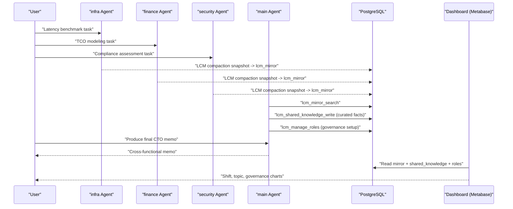
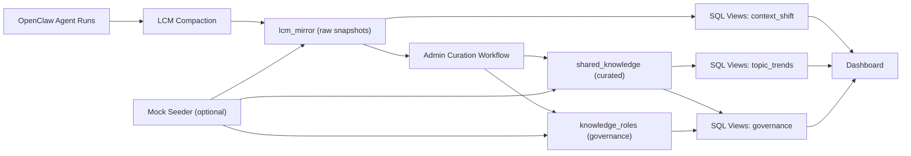

# LCM-PG Dashboard Demo Flow + Mock Data Flow Plan (Draft)
# LCM-PG 看板演示流程与模拟数据流方案（草案）

Status: Product decisions for v1 recorded (see §8). Implementation can proceed against `main`.
状态：v1 产品决策已记录在 §8，可按 `main` 继续落地实现。

---

## 1) Goal / 目标

### EN
Design a toB demo that proves three things with a PostgreSQL dashboard:

1. Context shift is visible and measurable over time.
2. Knowledge topics become structured and queryable after curation.
3. Governance (visibility/roles) is auditable for enterprise use.

### 中文
设计一个 toB 演示，通过 PostgreSQL 看板证明三件事：

1. 上下文内容迁移（context shift）可见且可量化。
2. 经过精选后，知识主题可结构化、可检索。
3. 治理能力（可见性/角色权限）可审计，满足企业场景。

---

## 2) Demo Scope / 演示范围

### EN
Data sources in scope:

- `lcm_mirror` (raw compacted snapshots per agent)
- `shared_knowledge` (curated knowledge)
- `knowledge_roles` (role mapping for access control narrative)

Out of scope in v1:

- Real-time streaming infra (Kafka/CDC)
- Embeddings/vector search dashboard
- Cross-workspace federation

### 中文
纳入演示的数据源：

- `lcm_mirror`（每个 Agent 的 compaction 摘要快照）
- `shared_knowledge`（精选共享知识）
- `knowledge_roles`（权限角色映射，用于治理叙事）

v1 不做：

- 实时流式基础设施（Kafka/CDC）
- 向量检索看板
- 跨 workspace 联邦查询

---

## 3) End-to-End Demo Flow / 端到端演示流程

### EN (Narrative Phases)

1. Specialists work independently (`infra`, `finance`, `security`).
2. LCM compaction writes snapshots into `lcm_mirror`.
3. `main` agent searches mirror and curates key facts into `shared_knowledge`.
4. Knowledge is reused by specialists and `main` to produce final CTO memo.
5. Dashboard shows shift/topic/governance outcomes.

### 中文（演示阶段）

1. 专家 Agent 并行工作（`infra`、`finance`、`security`）。
2. LCM compaction 后，快照写入 `lcm_mirror`。
3. `main` Agent 检索 mirror，并把关键结论写入 `shared_knowledge`。
4. 各 Agent 复用共享知识，最终产出 CTO 决策备忘录。
5. 看板展示：内容迁移、主题演化、治理状态。

### Mermaid: Interaction Flow / 交互流程图

---

## 4) Dashboard Page Plan / 看板页面规划

### EN

Page A: Context Shift Monitor

- KPI: snapshots/day
- KPI: active conversations/day
- Trend: shift score by agent (hourly/daily)
- Trend: content size trend (`char_length(content)`)
- Table: latest mirror records by agent

Page B: Knowledge Topic Map

- KPI: curated entries count
- Chart: top tags (`unnest(tags)`)
- Chart: topic trend by day
- Chart: topic momentum (last 7d vs previous 7d)
- Table: newest curated items (`title`, `visibility`, `tags`, `updated_at`)

Page C: Governance & Audit

- Chart: visibility distribution (`shared/restricted/private`)
- Chart: owner distribution (`owner_agent_id`)
- Table: role assignments (`knowledge_roles`)
- KPI: restricted entries count
- KPI: stale knowledge count (updated_at older than threshold)

### 中文

页面 A：上下文迁移监控

- 指标：每天快照数
- 指标：每天活跃会话数
- 趋势：按 Agent 的迁移分数（小时/天）
- 趋势：内容长度趋势（`char_length(content)`）
- 表格：各 Agent 最新 mirror 记录

页面 B：知识主题地图

- 指标：精选知识条目数
- 图表：高频标签（`unnest(tags)`）
- 图表：主题按天趋势
- 图表：主题动量（近 7 天 vs 前 7 天）
- 表格：最新精选条目（`title`、`visibility`、`tags`、`updated_at`）

页面 C：治理与审计

- 图表：可见性分布（`shared/restricted/private`）
- 图表：知识所有者分布（`owner_agent_id`）
- 表格：角色分配（`knowledge_roles`）
- 指标：受限知识条目数
- 指标：陈旧知识条目数（按 `updated_at` 阈值）

---

## 5) Mock Data Flow Plan / 模拟数据流方案

### EN

### 5.1 Two Data Modes

Mode 1: Live-assisted mock

- Use real OpenClaw runs from demo runbook.
- Backfill missing volumes with synthetic SQL inserts.

Mode 2: Full synthetic playback

- Seed all rows directly into `lcm_mirror` + `shared_knowledge`.
- Use deterministic timestamps for repeatable charts.

**v1 decision:** prioritize **Mode 2 (full synthetic playback)** first. Mode 1 (live-assisted mock) remains documented for later or hybrid demos.

### 5.2 Mock Data Targets (v1)

- Agents: `infra`, `finance`, `security`, `main`
- Conversations: 8-12
- Mirror rows: 240-360 (3 days, 1-hour buckets)
- Shared knowledge rows: 40-60
- Tags: 12-18 controlled topic tags

Suggested topic tags:

- `latency`, `cost`, `compliance`, `risk`, `timeline`, `migration`, `ops`, `security`, `architecture`, `decision`, `waf`, `cold-start`

### 5.3 Data Generation Steps

1. Initialize demo DB and tables.
2. Insert `knowledge_roles` baseline (admin + role groups).
3. Insert `lcm_mirror` rows:
   - realistic `captured_at` progression
   - controlled spikes in `content` length for shift visualization
4. Insert `shared_knowledge` rows:
   - balanced `visibility` distribution
   - controlled tag distribution for topic charts
5. Validate row counts and null checks.
6. Refresh dashboard.

### 中文

### 5.1 两种数据模式

模式 1：真实运行 + 模拟补齐

- 先用 runbook 产生真实数据。
- 对不足样本用 SQL 批量插入补齐。

模式 2：全量模拟回放

- 直接向 `lcm_mirror` + `shared_knowledge` 注入模拟数据。
- 使用固定时间分布，保证图表可复现。

**v1 决策：** 优先采用 **模式 2（全量模拟回放）**。模式 1 仍保留文档，供后续或混合演示使用。

### 5.2 模拟数据规模（v1）

- Agent：`infra`、`finance`、`security`、`main`
- 会话：8-12
- Mirror 行数：240-360（3 天、按小时桶）
- Shared knowledge 行数：40-60
- 标签：12-18 个受控主题标签

建议标签：

- `latency`、`cost`、`compliance`、`risk`、`timeline`、`migration`、`ops`、`security`、`architecture`、`decision`、`waf`、`cold-start`

### 5.3 生成步骤

1. 初始化演示库与表结构。
2. 插入 `knowledge_roles` 基线角色。
3. 插入 `lcm_mirror`：
   - 合理的 `captured_at` 时间序列
   - 有控制地制造 `content` 长度波动，便于展示 shift
4. 插入 `shared_knowledge`：
   - 平衡的 `visibility` 分布
   - 可控的标签分布，用于主题图
5. 校验行数与空值。
6. 刷新看板。

### Mermaid: Data Pipeline / 数据管线图

---

## 6) SQL View Blueprint (Draft) / SQL 视图蓝图（草案）

### EN

Planned views:

- `vw_context_shift_hourly`
- `vw_context_volume_daily`
- `vw_topic_trends_daily`
- `vw_topic_momentum_7d`
- `vw_governance_visibility_daily`
- `vw_governance_role_matrix`

### 中文

计划视图：

- `vw_context_shift_hourly`
- `vw_context_volume_daily`
- `vw_topic_trends_daily`
- `vw_topic_momentum_7d`
- `vw_governance_visibility_daily`
- `vw_governance_role_matrix`

---

## 7) Demo Acceptance Criteria / 演示验收标准

### EN

Functional:

- Dashboard loads all 3 pages under 5 seconds (local MacBook).
- Topic charts show at least 8 meaningful tags.
- Shift chart shows at least 2 visible spikes.

Narrative:

- Can explain baseline vs LCM-PG difference in under 2 minutes.
- Can show one governance control example (`restricted` visibility).

### 中文

功能：

- 本地 MacBook 看板 3 个页面均在 5 秒内加载。
- 主题图至少展示 8 个有效标签。
- 迁移趋势图至少出现 2 次明显波动峰值。

叙事：

- 2 分钟内讲清 baseline 与 LCM-PG 差异。
- 能现场演示 1 个治理控制案例（`restricted` 可见性）。

---

## 8) v1 Product decisions (recorded) / v1 产品决策（已记录）

### EN

| Topic | Decision |
|-------|----------|
| Dashboard stack | **SQL views only** — no lightweight API layer in v1. |
| Multi-tenancy | **Single workspace** — no tenant/workspace filters in v1. |
| Topic analytics | **Tags only** — do not parse `content` keywords in v1. |
| Data strategy | **Full synthetic playback first** (see §5.1 Mode 2). Live-assisted mock is out of scope for the first cut. |

### 中文

| 议题 | 决策 |
|------|------|
| 看板技术栈 | **仅 SQL 视图**，v1 **不加**轻量 API 层。 |
| 多租户 | **单 workspace**，v1 **不做** tenant/workspace 筛选。 |
| 主题统计 | **仅基于 `tags`**，v1 **不**从 `content` 解析关键词。 |
| 数据策略 | **优先全量模拟回放**（§5.1 模式 2）；首版不以「真实运行 + 模拟补齐」为主路径。 |

---

## 9) Next steps / 下一步

### EN

Implement in this order:

1. Create SQL views.
2. Create mock seeder SQL/script.
3. Build first dashboard in Metabase.
4. Freeze a repeatable demo dataset snapshot.

### 中文

建议实施顺序：

1. 先落 SQL 视图。
2. 再做模拟数据注入脚本（与 §8 一致：优先全量合成数据）。
3. 在 Metabase 搭建第一版看板。
4. 固化可重复的演示数据快照。
